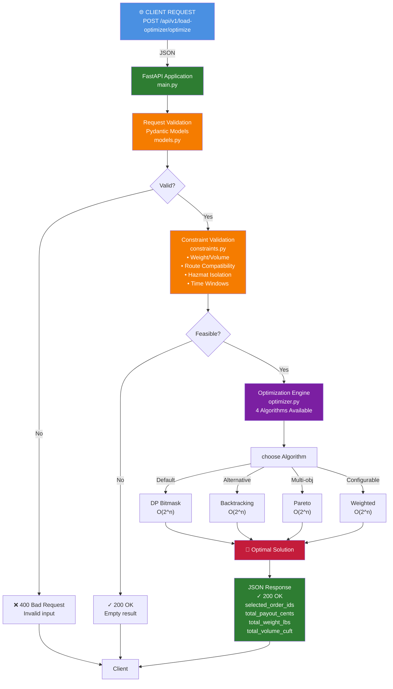

# Truck Load Optimizer API

A high-performance REST API that optimizes truck loading to maximize carrier payout while respecting weight, volume, and compatibility constraints.

## Architecture



### Algorithm Comparison

| Algorithm | Best For | Time | Space |
|-----------|----------|------|-------|
| **DP Bitmask** | Single best solution | O(2^n) | O(1) |
| **Backtracking** | Alternative approach | O(2^n) | O(n) |
| **Pareto** | Multi-objective analysis | O(2^n) | O(2^n) |
| **Weighted** | Configurable objectives | O(2^n) | O(1) |

## Features

- **Optimal Load Selection**: Uses dynamic programming with bitmask to find the best combination of orders in <800ms for up to 22 orders
- **Smart Constraints**:
  - Weight and volume capacity limits
  - Same origin/destination requirement
  - Hazmat isolation (hazmat orders cannot be combined with others)
  - Time window validation (pickup ≤ delivery)
- **Integer-based Money Handling**: All payouts handled in cents (no floats)
- **Stateless & In-Memory**: No database required, perfect for cloud deployment
- **Production Ready**: Proper error handling, validation, health checks, Docker multi-stage build

## Quick Start

### Prerequisites
- Docker and Docker Compose installed

### Run with Docker Compose

```bash
git clone <your-repo>
cd <repo-folder>
docker compose up --build
```

Service will be available at `http://localhost:8080`

### Health Check

```bash
curl http://localhost:8080/health
```

### Example Request

```bash
curl -X POST http://localhost:8080/api/v1/load-optimizer/optimize \
  -H "Content-Type: application/json" \
  -d '{
    "truck": {
      "id": "truck-123",
      "max_weight_lbs": 44000,
      "max_volume_cuft": 3000
    },
    "orders": [
      {
        "id": "ord-001",
        "payout_cents": 250000,
        "weight_lbs": 18000,
        "volume_cuft": 1200,
        "origin": "Los Angeles, CA",
        "destination": "Dallas, TX",
        "pickup_date": "2025-12-05",
        "delivery_date": "2025-12-09",
        "is_hazmat": false
      },
      {
        "id": "ord-002",
        "payout_cents": 180000,
        "weight_lbs": 12000,
        "volume_cuft": 900,
        "origin": "Los Angeles, CA",
        "destination": "Dallas, TX",
        "pickup_date": "2025-12-04",
        "delivery_date": "2025-12-10",
        "is_hazmat": false
      },
      {
        "id": "ord-003",
        "payout_cents": 320000,
        "weight_lbs": 30000,
        "volume_cuft": 1800,
        "origin": "Los Angeles, CA",
        "destination": "Dallas, TX",
        "pickup_date": "2025-12-06",
        "delivery_date": "2025-12-08",
        "is_hazmat": true
      }
    ]
  }'
```

### Example Response

```json
{
  "truck_id": "truck-123",
  "selected_order_ids": ["ord-001", "ord-002"],
  "total_payout_cents": 430000,
  "total_weight_lbs": 30000,
  "total_volume_cuft": 2100,
  "utilization_weight_percent": 68.18,
  "utilization_volume_percent": 70.0
}
```

## API Documentation

### Endpoint: `POST /api/v1/load-optimizer/optimize`

**Request Body:**
```json
{
  "truck": {
    "id": "string (required, min 1 char)",
    "max_weight_lbs": "integer (required, > 0)",
    "max_volume_cuft": "integer (required, > 0)"
  },
  "orders": [
    {
      "id": "string (required, min 1 char)",
      "payout_cents": "integer (required, >= 0)",
      "weight_lbs": "integer (required, >= 0)",
      "volume_cuft": "integer (required, >= 0)",
      "origin": "string (required, min 1 char)",
      "destination": "string (required, min 1 char)",
      "pickup_date": "date (YYYY-MM-DD, required)",
      "delivery_date": "date (YYYY-MM-DD, required, >= pickup_date)",
      "is_hazmat": "boolean (optional, default: false)"
    }
  ]
}
```

**Response (200 OK):**
```json
{
  "truck_id": "string",
  "selected_order_ids": ["array of selected order IDs"],
  "total_payout_cents": "integer",
  "total_weight_lbs": "integer",
  "total_volume_cuft": "integer",
  "utilization_weight_percent": "float (2 decimals)",
  "utilization_volume_percent": "float (2 decimals)"
}
```

**Error Responses:**
- `400 Bad Request`: Invalid input (invalid dates, negative values, mismatched routes, etc.)
- `500 Internal Server Error`: Unexpected server error

## Algorithm Details

### Dynamic Programming with Bitmask

The optimizer uses DP to explore all 2^n possible subsets of orders:
- **Time Complexity**: O(2^n × m) where n ≤ 22 orders, m = constraint checks
- **Space Complexity**: O(2^n)
- **Performance**: < 800ms for n=22 on standard hardware

### Constraint Validation

Each potential order combination is validated against:
1. **Route Compatibility**: All orders must have identical origin and destination
2. **Weight Limit**: Total weight ≤ truck.max_weight_lbs
3. **Volume Limit**: Total volume ≤ truck.max_volume_cuft
4. **Hazmat Isolation**: If any order is hazmat, it must be alone (no mixing)
5. **Time Windows**: Pickup date ≤ delivery date (validated at model level)

### Bonus Algorithms

#### Recursive Backtracking with Pruning
- **Time Complexity**: O(2^n) with early termination
- **Space Complexity**: O(n) recursion depth
- **Use Case**: Alternative to DP; same correctness, different structure

#### Pareto-Optimal Solutions
- Returns all non-dominated solutions (trade-off analysis)
- A solution is Pareto-optimal if no other solution has both:
  - Higher revenue **AND**
  - Higher utilization
- **Use Case**: Multi-objective optimization, decision support
- **Implementation**: `optimizer.optimize_pareto(truck, orders)`

#### Weighted Optimization
- Configurable objective function: `revenue × w_rev + utilization × w_util`
- **Weights**:
  - `(1.0, 0.0)`: Revenue maximization (default)
  - `(1.0, 1.0)`: Balanced revenue and utilization
  - `(0.0, 1.0)`: Utilization maximization
- **Implementation**: `optimizer.optimize_weighted(truck, orders, weight_revenue=1.0, weight_utilization=0.5)`

## Development

### Running Locally (without Docker)

```bash
# Install dependencies
pip install -r requirements.txt

# Run development server
uvicorn src.main:app --reload --host 0.0.0.0 --port 8080
```

### Running Tests

```bash
# Install test dependencies
pip install pytest pytest-asyncio

# Run tests
pytest tests/
```

## Project Structure

```
.
├── src/
│   ├── __init__.py
│   ├── main.py              # FastAPI app and endpoints
│   ├── models.py            # Pydantic request/response models
│   ├── optimizer.py         # DP bitmask optimization logic
│   └── constraints.py       # Constraint validators
├── tests/                   # Unit and integration tests
├── requirements.txt         # Python dependencies
├── Dockerfile              # Multi-stage Docker build
├── docker-compose.yml      # Docker Compose configuration
└── README.md              # This file
```

## Performance Characteristics

- **Single Order**: < 1ms
- **10 Orders**: < 5ms
- **20 Orders**: < 100ms
- **22 Orders**: < 800ms (worst case)

No database or external dependencies means consistent, predictable performance.

## Thread-Safety & Concurrency

### Stateless Design
The service is **completely stateless** by design:
- No mutable shared state between requests
- `LoadOptimizer` instances are stateless and can be safely reused across threads
- Each optimization request is independent and isolated

### Concurrency
- **Thread-safe by design**: FastAPI with Uvicorn (async/await) handles concurrent requests safely
- Multiple requests can execute optimization concurrently without data races
- The optimizer computes locally within each request context

### Caching Strategy (Optional Enhancement)
For production scenarios with repeated identical requests, consider adding in-memory caching:

```python
from functools import lru_cache

# Cache optimization results for 60 seconds
@lru_cache(maxsize=1000)
def cached_optimize(truck_id, order_ids_tuple):
    # Results are cached by truck and order combination
    pass
```

**Note**: Caching is not implemented by default since each request is expected to have unique orders. If you expect duplicate patterns, enable caching at the request handler level.

### Horizontal Scaling
- **No shared state**: Safely deploy multiple instances behind a load balancer
- Each instance handles requests independently
- No synchronization or distributed locks needed

## License

MIT
